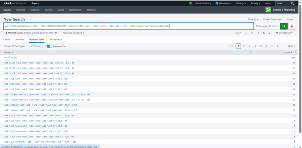
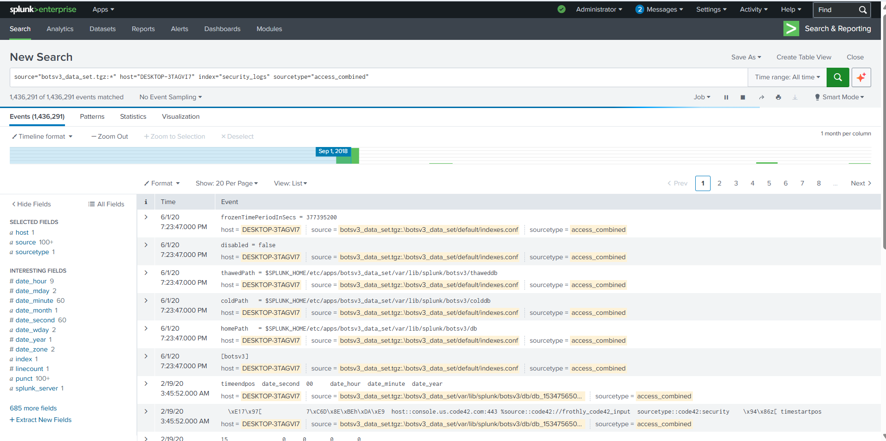
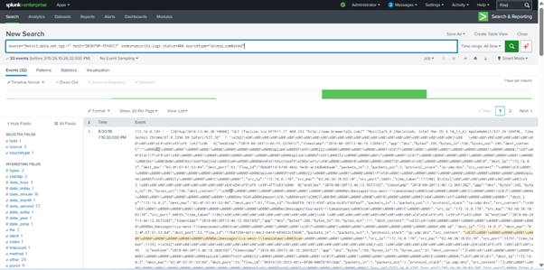
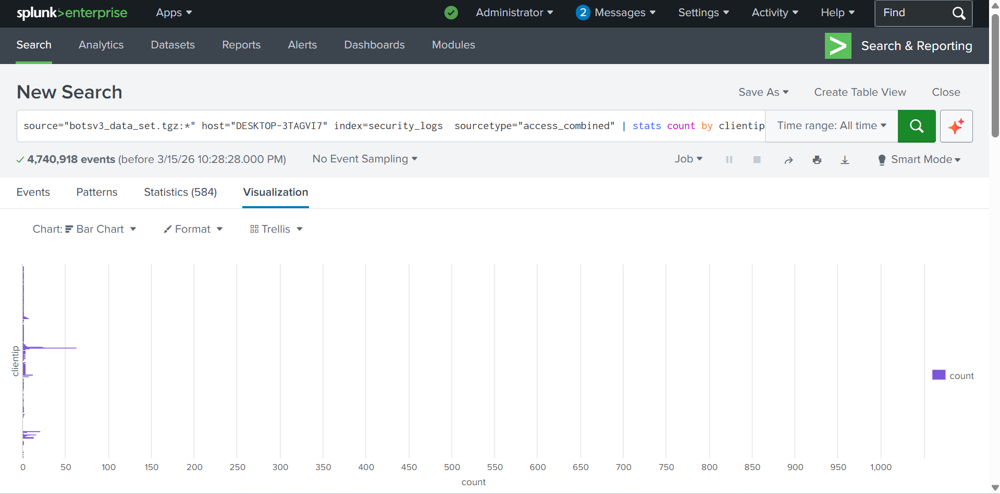

# Splunk SIEM Log Analysis Lab
Cybersecurity SIEM project analyzing security logs using Splunk.

## Overview
This project demonstrates basic Security Information and Event Management (SIEM) analysis using Splunk.

Security logs were ingested and analyzed using Splunk Search Processing Language (SPL) to identify suspicious patterns.

## Tools Used
- Splunk SIEM
- SPL (Search Processing Language)
- Apache Access Logs Dataset

## Lab Tasks

### 1. Log Ingestion
Security logs were imported into Splunk and verified through event searches.

### 2. Suspicious IP Detection
Top IP addresses generating traffic were identified.

Query used:
index=security_logs | stats count by clientip | sort -count

### 3. HTTP Error Detection
404 errors were analyzed to identify potential scanning activity.

Query used:
index=security_logs status=404

### 4. Traffic Visualization
Traffic sources were visualized using Splunk dashboards.

## Screenshots

